<div align="center">




<p>
  <a href="https://github.com/pinsql"></a>
  &nbsp;
  <a href="https://x.com/wildkenyan"></a>
</p>

<sub><code>STATUS: ONLINE</code> · <code>STACK: PROD-GRADE</code> · <code>DISCLOSURE: ETHICAL</code> · <code>LAST_DEPLOY: WHEN_IT_COMPILES</code></sub>

```
 ╔══════════════════════════════════════════════════════════════════╗
 ║    SELF-TAUGHT  ·  BACKEND  ·  NETWORK  ·  SYSTEMS  ·  OFFSEC    ║
 ║ Node · Python · PHP · Go · SQL · Linux · Docker · Nginx · CI/CD  ║
 ╚══════════════════════════════════════════════════════════════════╝
```

<i>Decentralization-curious. Firewall-aware. Intrusion-informed.</i><br/>
<b>Ethically disclosed</b> findings across <b>hundreds</b> of orgs — responsible disclosure, sharp writeups, no noise.

</div>

### `> neofetch`

```text
root@pinsql:~$ neofetch
        .-""""-.          root@pinsql
       /  _  _  \         ────────────────────────────────────────
      |  (o)(o)  |        OS        Linux (daily driver energy)
      |    /\    |        Role      Backend · NetEng · Systems · Offsec
       \  '--'  /         Stack     Node.js · Python · PHP · Go
        '-.__.-'          Infra     Docker · Nginx · CI/CD · Terraform
        /|    |\          Focus     APIs · hardening · recon · disclosure
       /_|____|_\         Contact   x.com/wildkenyan
                          Motto     break (legally) → learn → ship
```

### `> dmesg | tail -n 5`

```diff
+ [  OK  ] designing APIs that fail closed, not open
+ [  OK  ] tracing packets before blaming the database
+ [  OK  ] shipping small diffs; rolling forward, not hiding
+ [  OK  ] reading RFCs for fun (and fewer incidents)
- [ WARN ] unauthorized targets: permission denied (always)
```

### `> ls ~/stack`

<div align="center">


<sub><code>burp</code> · <code>nmap</code> · <code>metasploit</code> · <code>wireshark</code> · <code>ffuf</code> · <code>sqlmap</code> · <code>kali</code></sub>

</div>

### `> ./killchain.sh`

```text
 [ RECON ] ──► [ ENUM ] ──► [ EXPLOIT ] ──► [ PRIVESC ] ──► [ PIVOT ] ──► [ REPORT ]
```

<div align="center">

<b>Your network. Your rules.</b><br/>
<code>sudo stay-root</code> · <code>stay Fr3sty</code> 🖤

<br/><br/>


</div>

<!-- PinSQL profile README — pinsql/pinsql · mint/cyber theme -->
