<div align="center">


<a href="https://x.com/wildkenyan"></a>

<p>
  <a href="https://github.com/pinsql"></a>
  &nbsp;
  <a href="https://x.com/wildkenyan"></a>
</p>

<sub><code>STATUS: ONLINE</code> · <code>STACK: PROD-GRADE</code> · <code>DISCLOSURE: ETHICAL</code> · <code>LAST_DEPLOY: WHEN_IT_COMPILES</code></sub>



<i>Decentralization-curious. Firewall-aware. Intrusion-informed.</i><br/>
<b>Ethically disclosed</b> findings across <b>hundreds</b> of orgs — responsible disclosure, sharp writeups, no noise.

<br/>

<a href="https://x.com/wildkenyan"></a>

</div>

### `> ./ctf --target pinsql` 🏴

<sub>think you can pop this box? click your way in 👇</sub>

<details>
<summary><code>guest@void:~$ ssh guest@pinsql</code></summary>

```text
Connecting to pinsql:22 ...
SSH-2.0-curiosity_9.x
Warning: you are now being watched. Welcome, guest. 👁
```

<details>
<summary><code>guest@pinsql:~$ ls -la</code></summary>

```text
drwx------  root  root   4096  .
-rw-r--r--  guest guest   420  notes.txt
-r--------  root  root     37  .flag
```

<details>
<summary><code>guest@pinsql:~$ cat .flag</code></summary>

```diff
- cat: .flag: Permission denied
```

<details>
<summary><code>guest@pinsql:~$ cat notes.txt</code></summary>

```text
todo: stop leaving sudo NOPASSWD on /usr/bin/less
      ...nobody reads these anyway
```

<details>
<summary><code>guest@pinsql:~$ sudo less .flag</code></summary>

```diff
+ [*] GTFOBins: less → !/bin/sh
+ [+] uid=0(root) gid=0(root) groups=0(root)
+
+ flag{st4y_r00t_st4y_fr3sty}
```

<b>🏆 box pwned.</b> screenshot this and drop it at <a href="https://x.com/wildkenyan">@wildkenyan</a>. first blood gets a shoutout.

</details>
</details>
</details>
</details>
</details>

### `> ls -la ~/ops` 🗂

<div align="center">

<a href="https://github.com/pinsql?tab=repositories"></a>

<sub><a href="https://github.com/pinsql/citadel"><code>citadel</code></a> · <a href="https://github.com/pinsql/simple-python-network-scanner"><code>network-scanner</code></a> · <a href="https://github.com/pinsql/mac_address_scanner"><code>mac_scanner</code></a> · <a href="https://github.com/pinsql/AI-Sentiment-Analyzer"><code>sentiment</code></a> · <a href="https://github.com/pinsql/steveweb_protfolio"><code>portfolio</code></a></sub>

</div>

### `> ./telemetry --window 365d` 📡

<div align="center">


</div>

### `> tail -f /var/log/contributions` 🐍

<div align="center">

<picture>
  <source media="(prefers-color-scheme: dark)" srcset="https://raw.githubusercontent.com/pinsql/pinsql/output/snake-dark.svg" />
  <source media="(prefers-color-scheme: light)" srcset="https://raw.githubusercontent.com/pinsql/pinsql/output/snake-light.svg" />
  
</picture>

<sub><code>[*] worm deployed · every green square consumed · no survivors</code></sub>

</div>

<div align="center">

<b>Your network. Your rules.</b><br/>
<code>sudo stay-root</code> · <code>stay Fr3sty</code> 🖤

<br/><br/>


</div>

<!-- PinSQL profile README — pinsql/pinsql · mint/cyber theme -->
